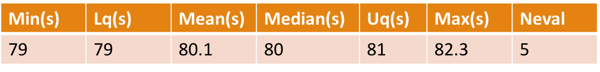
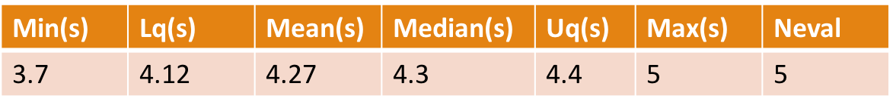
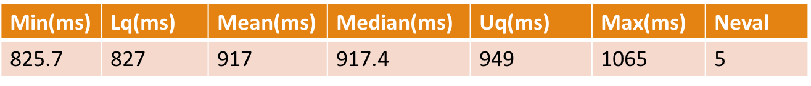
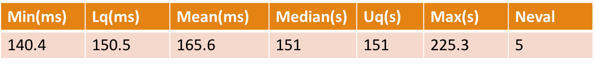
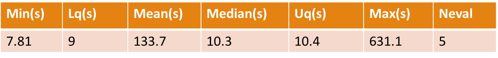

```{r setup, include=FALSE}
knitr::opts_chunk$set(echo = TRUE)
```

## Google Bigquery
- Storing and querying massive datasets can be time consuming and expensive without the right
hardware and infrastructure.
- Google BigQuery is an enterprise data warehouse that enables
super-fast SQL queries using the processing power of Google's infrastructure.

## MongoDB

- MongoDB stores data in flexible, JSON-like documents, meaning fields can vary from document to document and data structure can be changed over time -  NoSQL database 
- The document model maps to the objects in your application code, making data easy to work with
- Ad hoc queries, indexing, and real time aggregation provide powerful ways to access and analyze your data

## Apache Drill 

- Schema-free SQL Query Engine for Hadoop, NoSQL and Cloud Storage
- Drill's datastore-aware optimizer automatically restructures a query plan to leverage the datastore's internal processing capabilities. 
- Drill supports data locality, so it's a good idea to co-locate Drill and the datastore on the same nodes
- Agile
- Flexible


## Comparing BigQuery, MongoDB, Apache Drill as backend

## Query eQTL Bigquery

- Expr: 
- (eqtl_tbl %>% filter(chr == mychr) %>% filter(snp_pos >= mystart) %>% filter(snp_pos <= myend) %>% as.data.frame())
- file : Breast_Mammary_Tissue_Analysis.v6p.all_snpgene_pairs_eQTL (13.57 GB)
- Unit : seconds



## Query eQTL MongoDB

- Expr : my_collection$find(myquery) 
- my_collection : Breast_Mammary_Tissue_Analysis.v6p.all_snpgene_pairs_eQTL
- Unit : seconds



##Query FP Bigquery

- Expr : 
- (fp_tbl %>% filter(chr == mychr) %>% filter(start >= mystart) %>% filter(end <= myend) %>% as.data.frame())
- file - vHMEC_DS18406_footprint.bed (3.84 GB)
- Unit : milliseconds



## Query FP MongoDB

- Expr : my_collection$find(myquery)
- my_collection : vHMEC_DS18406_footprint
- Unit : milliseconds



## Query TF Bigquery

- Expr : 
- (tf_tbl %>% filter(chr == mychr) %>% filter(start >= mystart) %>% filter(end <= myend) %>% as.data.frame())
- file : - M2283_1.02.bed (30.9 MB)
- TF : FOXP1
- Unit : seconds



## Query TF Drill

- Expr : rd_query(mydrill, myquery)
- M2283_1.02.bed 
- TF : FOXP1
- Unit : seconds

