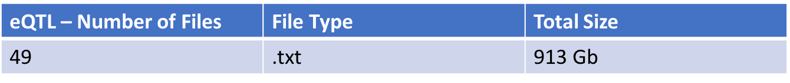
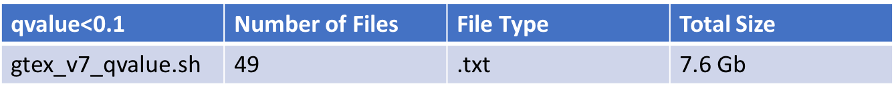
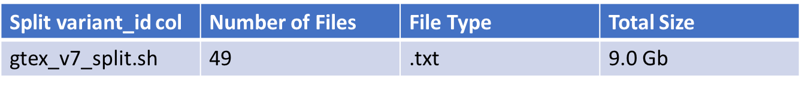
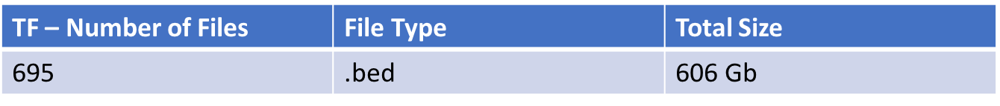
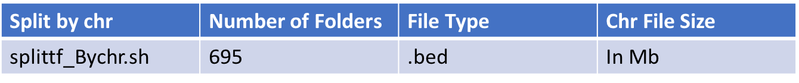
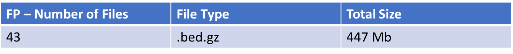
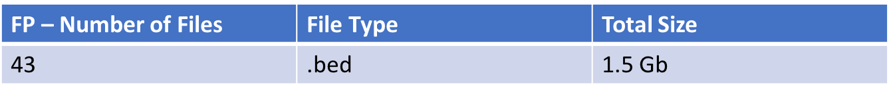
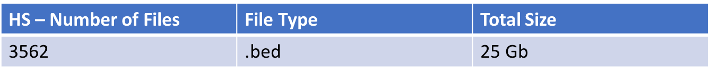
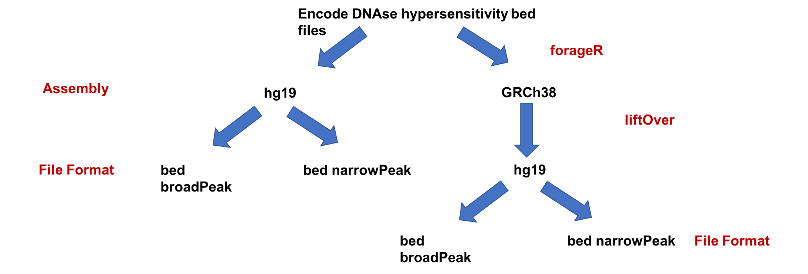

#Infrastructure 

- All the datasets (eQTL, Footprint, Hyperssensitivity Files) can be found as distinct collections on MongoDB in a database named "txregnet"
- Nomenclature of the collections:
  a.) For eQTLs - eg : Stomach_allpairs_v7_eQTL, Spleen_allpairs_v7_eQTL
  b.) For Hypersensitivity files - ENCFF990OJZ_hg19_HS
  c.) For Footprint Data - vHMEC_DS18406_FP 

- MongoDB is running on shion (BJ's machine)
- Connection/access to MongoDB can be made from within the network (capecod,shion)

#Data Processing

# eQTL 

a. ) Source files : 
     - Location of capecod : /proj/rerefs/reref00/Broad/GTEx_v7/TISSUES_MODIFIED
     - GTex Version 7
     - Extra files (6 Gb) - line_count_rsid.txt,line_count.txt,GTEx_Analysis_v7.metasoft.txt, README. 
     - All the scripts and processed/final files can be found on shion : /home/reshg/eQTL_gtexv7/

b.) Data Processing :

-- Raw Data :  
Raw 49 files - each for different tissues. 

Processing:

Filter the files at q-value<0.1

Split the variant_id column into chr, snp_pos, A1, A2, build columns

3. Import the files as distinct collections for each file(each tissue) to "txregnet" mongo database

Script : import_gtexv7_eqtl.sh 

4. Index each file at snp_pos column ( ascending order index, done inside mongo)

# Transcription Factor Data

a. ) Source files : 
     - Location on capecod :
       Kimbie's CISBP FIMO scan TF bed files: /udd/rekrg/EpiPANDA/FIMO_results/ScanBedResults - http://cisbp.ccbr.utoronto.ca/faq.html is origin of PSSM

     - All the scripts and processed/final files can be found on capecod : /udd/reshg/chrfiles_tf

b.) Data Processing :

Raw Data : 

Each .bed file is split by chromosome.

# Annotations

## Roadmap digital genomic footprints

a. ) Source files : 
     - Location of capecod :
       Roadmap digital genomic footprints: /udd/reala/reference_files/annotations/ROADMAP_DGF
     - Extra file : README.md 
     - All the scripts and processed/final files can be found on shion : /home/reshg/FP/

b.) Data Processing :

Raw Data :

Only processing step done is gunzip the files. 

2. Import the files as distinct collections for each file to "txregnet" mongo database

Script : import_FP.sh 

3. Index each file at start and end columns ( ascending order index, done inside mongo)

## Encode DNAse hypersensitivity bed files

a.) Source Files : 
      - Location on capecod :
      /proj/rerefs/reref00/ENCODE/DNaseI_Roadmap_Encode/BEDFILES
      - Extra Files : PassingQC_Hotspot_Peaks_PJC_7.13.2017.tsv, README
      - All the scripts and processed/final files can be found on shion : /home/reshg/HS/
      
b.) Data Processing : 
Raw Data : 

Unzipped : 25 Gb on shion

1. Unzip -> liftOver -> Sort File Formats

2. Import the files as distinct collections for each file to "txregnet" mongo database
Scripts : auto_importhg19.sh, auto_importliftoverfile.sh

3. Index each file at chromStart and chromEnd columns ( ascending order index, done inside mongo)

Note : 
-- File Formats : 

1. broadPeak :
This format is used to provide called regions of signal enrichment based on pooled, normalized (interpreted) data. It is a BED 6+3 format.

chrom - Name of the chromosome (or contig, scaffold, etc.).
chromStart - The starting position of the feature in the chromosome or scaffold. The first base in a chromosome is numbered 0.
chromEnd - The ending position of the feature in the chromosome or scaffold. The chromEnd base is not included in the display of the feature. For example, the first 100 bases of a chromosome are defined as chromStart=0, chromEnd=100, and span the bases numbered 0-99. If all scores were "0" when the data were submitted to the DCC, the DCC assigned scores 1-1000 based on signal value. Ideally the average signalValue per base spread is between 100-1000.
name - Name given to a region (preferably unique). Use "." if no name is assigned.
score - Indicates how dark the peak will be displayed in the browser (0-1000).
strand - +/- to denote strand or orientation (whenever applicable). Use "." if no orientation is assigned.
signalValue - Measurement of overall (usually, average) enrichment for the region.
pValue - Measurement of statistical significance (-log10). Use -1 if no pValue is assigned.
qValue - Measurement of statistical significance using false discovery rate (-log10). Use -1 if no qValue is assigned.

2. narrowPeak : 

This format is used to provide called peaks of signal enrichment based on pooled, normalized (interpreted) data. It is a BED6+4 format.

chrom - Name of the chromosome (or contig, scaffold, etc.).
chromStart - The starting position of the feature in the chromosome or scaffold. The first base in a chromosome is numbered 0.
chromEnd - The ending position of the feature in the chromosome or scaffold. The chromEnd base is not included in the display of the feature. For example, the first 100 bases of a chromosome are defined as chromStart=0, chromEnd=100, and span the bases numbered 0-99.
name - Name given to a region (preferably unique). Use "." if no name is assigned.
score - Indicates how dark the peak will be displayed in the browser (0-1000). If all scores were "'0"' when the data were submitted to the DCC, the DCC assigned scores 1-1000 based on signal value. Ideally the average signalValue per base spread is between 100-1000.
strand - +/- to denote strand or orientation (whenever applicable). Use "." if no orientation is assigned.
signalValue - Measurement of overall (usually, average) enrichment for the region.
pValue - Measurement of statistical significance (-log10). Use -1 if no pValue is assigned.
qValue - Measurement of statistical significance using false discovery rate (-log10). Use -1 if no qValue is assigned.
peak - Point-source called for this peak; 0-based offset from chromStart. Use -1 if no point-source called

Reference : https://genome.ucsc.edu/FAQ/FAQformat.html#format12
