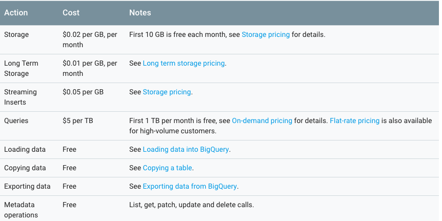
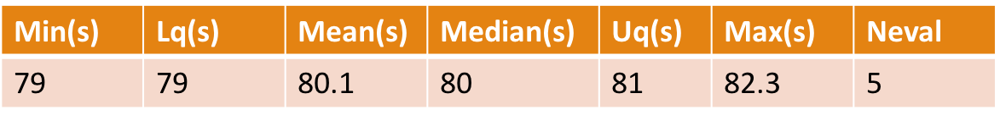

## Google Cloud Storage
- Bucket Name - test_data_txreg
- Location : US, Default Storage Class: Multi- Regional

## Cost

- Project storage and bandwidth usage charges accrue daily, but Google Cloud Storage bills you only at the end of the billing period.
- Distributed across Storage, Operations, Network mainly.
- Storage Cost:
  

- Operations cost

## 
- Network cost

e:g: 
- 50 GB Multi-Regional Storage at $0.026/per GB: $1.30
- 10 GB of network egress at $0.12/per GB: $1.20
- 10,000 Class A operations at $0.05/per 10,000 operations: $0.05
- 10,000 Class B operations at $0.004/per 10,000 operations: $0.004
Total : $2.554

## Google Bigquery
- Storing and querying massive datasets can be time consuming and expensive without the right
hardware and infrastructure.
- Google BigQuery is an enterprise data warehouse that enables
super-fast SQL queries using the processing power of Google's infrastructure.

## Cost

- Loading,copying,exporting,list,get,patch,update and delete operations are free.
- Free tier pricing : The first 10 GB of storage is free of charge each month(per billing account).

## Comparing BigQuery and MongoDB as backend

## Query eQTL Bigquery

- Expr: (eqtl_tbl %>% filter(chr == mychr) %>% filter(snp_pos >= mystart) %>% filter(snp_pos <= myend) %>% as.data.frame())
- file : Breast_Mammary_Tissue_Analysis.v6p.all_snpgene_pairs_eQTL (13.57 GB)
- Unit : seconds

## Query eQTL MongoDB

- Expr : my_collection$find(myquery) 
- my_collection : Breast_Mammary_Tissue_Analysis.v6p.all_snpgene_pairs_eQTL
- Unit : seconds

##Query FP Bigquery

- Exprs : (fp_tbl %>% filter(chr == mychr) %>% filter(start >= mystart) %>% filter(end <= myend) %>% as.data.frame())
- file - vHMEC_DS18406_footprint.bed (3.84 GB)
- Unit : milliseconds

## Query FP MongoDB

- Exprs : my_collection$find(myquery)
- my_collection : vHMEC_DS18406_footprint
- Unit : milliseconds

## Query TF Bigquery

- Expr : (tf_tbl %>% filter(chr == mychr) %>% filter(start >= mystart) %>% filter(end <= myend) %>% as.data.frame())
- file : - M2283_1.02.bed (30.9 MB)
- TF : FOXP1
- Unit : seconds

## Query TF Drill

- Expr : rd_query(mydrill, myquery)
- M2283_1.02.bed 
- TF : FOXP1
- Unit : seconds

