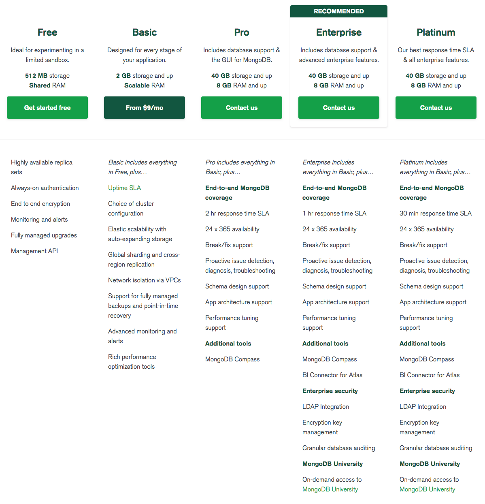
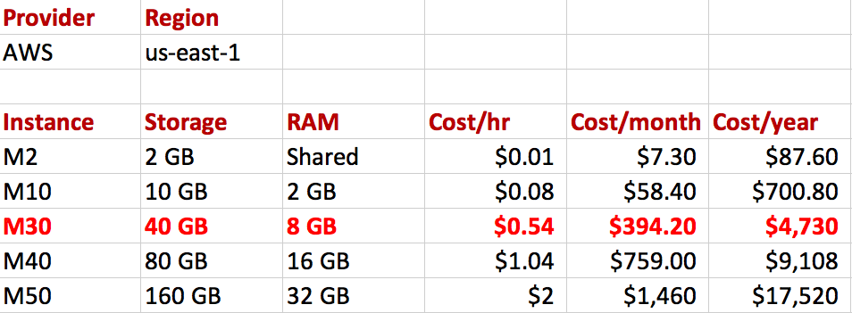
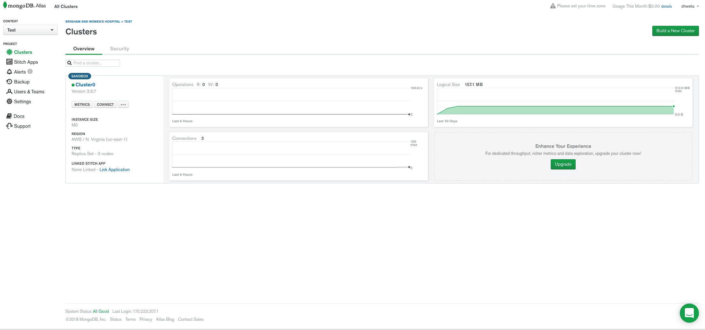
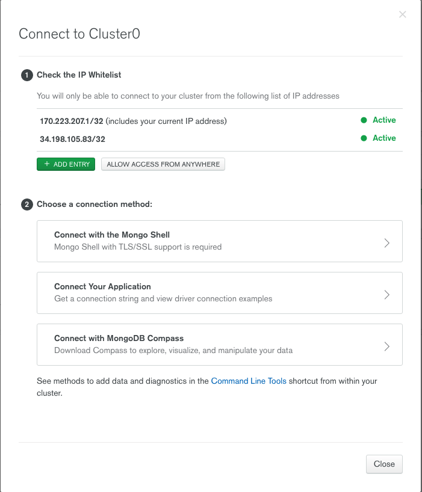
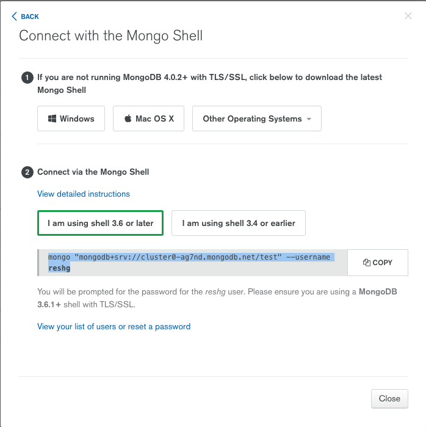

# MongoDB Atlas

- Delivers the world’s leading database for modern applications as a fully automated cloud service. 
- Proven operational and security practices are built in, automating time-consuming administration tasks such as infrastructure provisioning, database setup, ensuring availability, global distribution, backups, and more. 
- The easy-to-use UI and API let you spend more time building your applications and less time managing your database.


# Available Plans 




# Pricing 




# How to work with MongoDB Atlas

- Create an Atlas User Account

- Create an Atlas Free Tier Cluster 




# Connect to a Cluster 

- Check the IP Whitelist

- Choose a Connection Method ( mongo shell )

- Start a terminal and enter the connection command, enter password when prompted

- Can perform mongo commands from here







# Import data into a Cluster

- Grab the cluster name for --host

mongoimport --host  cluster0-shard-00-00-ag7nd.mongodb.net:27017 --db encode --type csv --file cebpbgr.csv --authenticationDatabase admin --ssl --username reshg --password 
    
    
# Query the data from R 

- To query the 10 CEBPB GRanges collection 

```{r do}
library(mongolite)
url="mongodb+srv://cluster0-ag7nd.mongodb.net/test"
mongo(collection="cebpbgr",db="encode",url=url)

```

# Reference

https://docs.atlas.mongodb.com/

